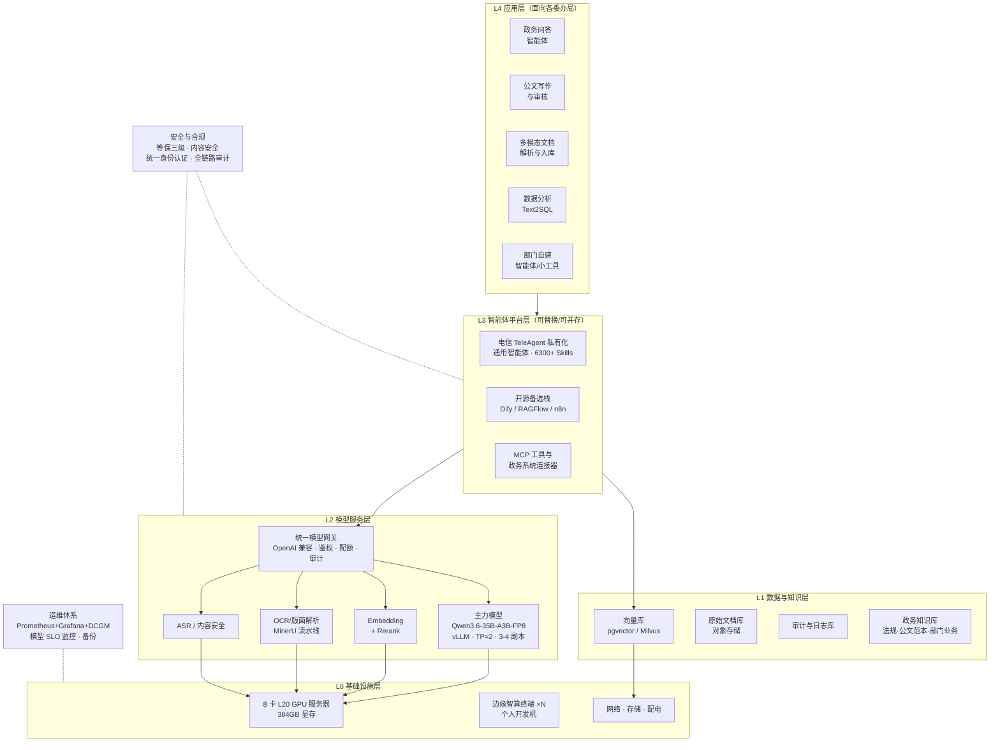

# 溧阳市政务 AI 算力与智能体平台 — 解决方案草稿

> 版本：v0.1 草稿（内部）
> 对应需求：《01-客户需求分析》；技术依据：《03-原报告技术校核与勘误》；待确认事项：《04-待确认问题清单》
> 硬件基线：NVIDIA L20（沿用客户既定选型）｜平台基线：中国电信 TeleAgent 私有化（待适配性确认）｜时限：本月底完成私有化交付

---

## 一、设计原则

本方案围绕五条原则展开，每条都直接对应《01》中识别出的一个风险：

| 原则 | 针对的风险 |
| --- | --- |
| **① 平台层与模型层彻底解耦**——所有智能体平台一律通过 OpenAI 兼容网关消费模型能力，不与任何单一模型或平台绑定 | TeleAgent 对 NVIDIA 的适配性尚未确认，架构必须让"TeleAgent / 昇腾节点 / 开源栈"三条路径都能平滑接入或替换 |
| **② 双轨交付**——功能验证轨不依赖新硬件到货，硬件建设轨并行推进 | 8 卡服务器到货周期与 TeleAgent 企业版可交付性均不由我方控制，但"月底"是硬约束 |
| **③ 不切 GPU，只切配额**——统一模型服务 + 网关配额分配，替代 vGPU 切卡 | L20 不支持 MIG；切卡会让利用率与并发能力大幅下降 |
| **④ 小 TP、多副本**——TP=2 为主，靠副本数横向扩展 | L20 无 NVLink，大 TP 在 PCIe 上通信开销过高 |
| **⑤ 先把知识建起来，再谈微调** | 报告 200 万预算全投硬件、零投知识库，是"算力买齐却无应用可用"的最大隐患 |

---

## 二、总体架构



**架构的关键一笔在 L2 的统一网关**：无论上层最终选 TeleAgent、昇腾方案还是开源栈，都通过同一个 OpenAI 兼容接口取用模型能力。这样一来，第三方交付节奏的不确定性被隔离在 L3，不会阻塞 L0–L2 的建设。

---

## 三、L0 基础设施层

### 3.1 一期 8 卡卡位编排（核心设计）

不做 GPU 切分，按"功能分区 + 高峰弹性"编排：

| GPU | 常态用途 | 显存占用 | 说明 |
| --- | --- | --- | --- |
| 0–1 | 主力模型副本 #1（TP=2） | ~40GB 权重 + ~48GB KV 池 | 承担在线问答/公文主流量 |
| 2–3 | 主力模型副本 #2（TP=2） | 同上 | 同上 |
| 4–5 | 主力模型副本 #3（TP=2） | 同上 | 同上 |
| 6 | 辅助模型池：Embedding + Rerank + 内容安全 + ASR | 合计 < 12GB | 单卡多模型共驻，余量用于文档解析批处理 |
| 7 | 开发 / LoRA 微调 / 新模型验证 / 压测 | 弹性 | 与 GPU 6 可临时组成副本 #4 应对高峰 |

**弹性策略**：业务高峰（工作日 9–11 点、14–16 点）时将 GPU 6–7 切换为主力模型副本 #4，辅助模型临时降级至 CPU 或与主副本共卡；夜间与非高峰时段释放 GPU 6–7 用于文档批量解析、知识库重建索引、LoRA 微调等离线任务。**这种"白天服务、夜间批处理"的分时复用，是单机资源利用率最大化的关键，也是本方案相对报告"静态分配"思路的主要增益。**

**服务能力**（详细推导见《03》第三节）：
- 稳态 **80–150 路并发流式生成**，人均输出 17–26 tok/s；
- 单流峰值输出 60–120 tok/s；
- 文档解析 **20–60 页/秒**；
- 按活跃并发占注册用户 5%–10% 反推，**可服务 1500–3000 名注册用户**，已覆盖溧阳市各委办局实际人员规模。

### 3.2 存储规划（本地盘，需补备份）

系统盘 2×960GB SSD（RAID1）；数据盘 4×3.84TB NVMe，建议 RAID5（可用约 11.5TB）而非 RAID10，以换取容量：

| 用途 | 容量 |
| --- | --- |
| 模型仓库（主模型多版本 + 辅助模型 + 未来模型） | 800 GB |
| 向量库与索引 | 800 GB |
| 原始文档库（存量政务文件） | 3 TB |
| 审计与日志（等保要求留存 ≥6 个月） | 1.5 TB |
| 微调数据集与 checkpoint | 1.5 TB |
| 容器镜像与平台数据 | 500 GB |
| 预留 | 余量 |

**缺口与建议**：本地盘方案下单机故障即全量数据不可用，且二期两台服务器无共享存储、模型需存两份、向量库无高可用、审计日志分散（与等保集中留存要求不符）。建议**至少增配一套入门级 NAS（约 3–5 万，容量 20–40TB）**承载模型仓库、审计日志与文档库；若预算无法追加，退而求其次的做法是用一台边缘智算终端（4TB NVMe）搭 MinIO 承担最小备份职责，并制定明确的备份策略与恢复演练。

### 3.3 网络

| 阶段 | 现状 | 措施 |
| --- | --- | --- |
| 一期 | 交换机排在二期，但一期已有 1 台服务器（2×25G 光口）+ 4 台边缘终端（10GbE RJ45） | **必须现场核实现有政务网交换机的可用端口类型与数量**；若无 25G SFP28 端口，需增配转换或临时借用端口。此项为设备到货后能否联网的前置条件 |
| 二期 | 48×SFP28 + 8×QSFP28 交换机 | 满足 25G 接入 + 100G 上行，配置充分 |
| 未来 | 如需跨机张量并行 | 需为每台 GPU 服务器增配 1×100G RoCE 网卡并配置无损网络（成本数万元）。二期交换机 QSFP28 端口已预留条件，**这是一条低成本的能力升级路径，建议在方案中作为"预留未来"卖点点明** |

**明确定位**：二期两台服务器之间做**副本级横向扩展与主备冗余**，不做跨机张量并行（《03》4.3）。

### 3.4 机房条件（一期落地的现实阻塞项）

- 单台 8 卡服务器满载约 **4.0–4.5kW**，机柜配电需 **≥6kW**（单相 220V/32A ≈ 7kW 可满足）；
- 制冷需承载约 4kW 热负荷（≈1.2 冷吨）；
- 二期两台同柜需 **≥10–12kW**，超出多数政务机房单柜 4–6kW 的上限，**很可能需分柜部署或改造配电**；
- 噪音 70dB+，必须入机房，不可置于办公区；
- **建议在硬件订货的同时启动机房勘察**，此项与硬件采购并行，不应串行等待。

### 3.5 边缘智算终端定位

按报告规格（128GB LPDDR5x / 273GB/s / 本地 FP4 跑 200B）对应 NVIDIA DGX Spark（GB10）。

- **定位**：专家小组与各委办局技术人员的**个人开发/试验机**，用于原型验证、离线试验、敏感数据本地处理；
- **能力边界**：单台流畅并发 1–2 路（受 273GB/s 带宽制约），**不承担部门级服务**；
- **联机**：官方上限 2 台（ConnectX-7 200G DAC 直连），且带宽不叠加，联机只提升可容纳模型规模、不提升生成速度；
- **可跑模型**：Qwen3.6-35B-A3B（FP8 或 Q4，Q4 仅需 20–25GB，极为宽裕）、32B 以下稠密模型 Q4；
- **建议**：一期先配 2 台交付给数据局与溧投数科（实际开发主力），另 2 台待场景明确后再补，释放的预算优先投入知识库建设（见第九节）。

### 3.6 操作系统与基础软件

| 组件 | 建议 | 说明 |
| --- | --- | --- |
| OS | Ubuntu 22.04/24.04 LTS 优先；若强制信创则用麒麟 V10 SP3 | **麒麟 + 海光 CPU + NVIDIA 驱动的三方组合必须在 POC 阶段实测验证**，不可假定可用 |
| 驱动/CUDA | NVIDIA Data Center Driver + CUDA 12.x | 需验证在海光平台的 IOMMU/ACS 设置与 PCIe 拓扑 |
| 容器 | Docker + NVIDIA Container Toolkit | |
| 编排 | **一期用 Docker Compose，二期再上 K8s + GPU Operator** | 一期时间紧、单机部署，K8s 只会增加交付风险；二期多机高可用时再引入 |
| NCCL 验证 | `nccl-tests` 实测 8 卡 all-reduce 带宽 | 无 NVLink 下 PCIe P2P 是否正常开启，直接决定 TP 效率，**是 POC 必测项** |

---

## 四、L2 模型服务层

### 4.1 模型选型清单

沿用并强化客户已选定的主力模型，补齐其余 5 类缺失能力：

| 层次 | 模型 | 精度/规格 | 卡位 | 承载场景 |
| --- | --- | --- | --- | --- |
| **主力（对话+多模态+Agent）** | **Qwen/Qwen3.6-35B-A3B-FP8** | FP8，~40GB，TP=2 | GPU 0–5（3 副本） | 政务问答、公文写作与审核、多模态文档理解、Text2SQL、智能体推理与工具调用 |
| Embedding | bge-m3 或 Qwen3-Embedding | ~2.5GB | GPU 6 | RAG 向量化，中文与长文本表现好 |
| Rerank | bge-reranker-v2-m3 或 Qwen3-Reranker | ~2.5GB | GPU 6 | RAG 精排，显著提升法规类问答准确率 |
| 版面解析/OCR | **MinerU 2.x** + 主模型视觉能力 | 流水线 | GPU 6/7 | 存量红头文件、扫描 PDF、表格、印章。**客户提供的报告本身即 MinerU 解析产物，技术栈已被客户验证** |
| ASR | SenseVoice / FunASR / Whisper-large-v3 | ~1–3GB | GPU 6 | 会议记录、12345 热线（若纳入场景） |
| 内容安全 | 规则库 + 小模型分类器 | ~1–2GB | GPU 6 或 CPU | **政务场景强制的输入输出双向合规过滤** |

**为什么不再引入 122B 级模型**：Qwen3.6-35B-A3B 在 MMMU 81.7、MathVista 86.4、RealWorldQA 85.3、OmniDocBench 89.9、SWE-bench Verified 73.4 等基准上已达到甚至超过 Claude Sonnet 4.5 水平，多模态与文档理解能力完全覆盖报告设想的"122B 多模态"需求；而 122B 稠密模型在 L20（无 NVLink）上需 TP=4 至 TP=8，吞吐与并发大幅下降、性价比显著更差（《03》5.1）。**一个模型覆盖全部场景，同时大幅简化运维——这是本方案在模型层的核心主张。**

**Thinking / Non-Thinking 双模式的场景化使用**（客户报告已注意到此特性，方案应落实）：

| 模式 | 适用场景 | 效果 |
| --- | --- | --- |
| Non-Thinking | 政务问答、简单检索、格式转换 | 响应快，TTFT 低，并发高 |
| Thinking | 公文审核、政策比对、复杂数据分析、多步任务规划 | 质量显著提升，但输出 token 数增加数倍，并发相应下降 |

**建议在网关侧按场景路由模式，而非交给用户自选**——否则用户会全程开启 Thinking，并发容量被无谓消耗数倍。这是一个容易被忽略但影响巨大的运营细节。

### 4.2 推理引擎与部署参数

**主引擎 vLLM**（Qwen3.6 官方支持，生态成熟），SGLang 作为备选（多轮对话前缀缓存更优，长上下文场景可对比后决定）。

单副本启动参数框架（具体值以压测校准）：

```bash
vllm serve Qwen/Qwen3.6-35B-A3B-FP8 \
  --tensor-parallel-size 2 \
  --max-model-len 32768 \
  --gpu-memory-utilization 0.92 \
  --enable-prefix-caching \
  --reasoning-parser qwen3 \
  --served-model-name gov-chat \
  --port 8000
```

调优要点：
- `--max-model-len` 先设 32K 覆盖绝大多数政务场景；**不要一上来就开 262K**，KV 池会被少量长请求占满，反而拉低整体并发。可另起一个小规模长上下文副本专门处理超长文档；
- `--enable-prefix-caching` 对政务场景收益极大——系统提示词、公文模板、法规片段高度重复；
- 多模态请求（图片/PDF 页）的 prefill 开销远大于纯文本，**建议在网关侧为文档解析类请求单独限流**，避免挤占在线问答的 TTFT；
- MoE 模型的批处理调度对吞吐影响显著，`--max-num-seqs` 需实测寻优。

### 4.3 统一模型网关（本方案的枢纽组件）

选型建议：Higress AI 网关、One API / New API 或 LiteLLM（按运维熟悉度决定，中文文档与政务部署便利性优先）。

必备能力：

| 能力 | 用途 |
| --- | --- |
| OpenAI 兼容接口 | 让 TeleAgent、Dify、部门自研应用用同一套标准接入，**这是"平台可替换"的技术基础** |
| 按部门发放 API Key + token 配额 | **替代 GPU 切卡**，实现多部门资源分配（原则③） |
| 全量请求/响应审计留痕 | 等保要求：谁、何时、问了什么、模型答了什么、调了哪些工具 |
| 内容安全前置/后置过滤挂载点 | 政务合规底线 |
| 多副本负载均衡与健康检查 | 3–4 个副本的流量分发；二期跨机扩展的基础 |
| 按场景路由（模型/模式选择） | Thinking / Non-Thinking 自动路由（见 4.1） |
| 用量统计与报表 | 向各委办局展示使用情况，也是二期扩容的决策依据 |

---

## 五、L3 智能体平台层

### 5.1 主线：电信 TeleAgent 私有化

采纳客户倾向。TeleAgent 的优势与本项目诉求高度契合：

- **开箱能力强**：内置 6300+ Skills，覆盖文案撰写、代码编写、深度调研、运维支持、任务自动执行，支持任务自动规划、长时间运行与批量处理。相比从零搭建，能最大程度压缩"月底可演示"的交付压力；
- **安全设计对口**：围绕"感知、推理、执行、记忆"四层安全防护，可信可控可审计贯穿全生命周期，与等保诉求同频；
- **央企背书**：政务采购场景下，中国电信全栈自研 + 国产智算底座的定位具有实质的合规与政治价值；
- **交付形态明确**：官方提供私有化本地部署与属地专属运维方案，可依托江苏电信/常州分公司落地属地服务。

**三个必须前置确认的事项**（《04》第一节）：

1. **是否支持 NVIDIA CUDA 推理**。TeleAgent 公开信息为"联合华为昇腾完成底层算力适配"，与客户 L20 选型不一致。三条应对路径见 5.3；
2. **私有化最小资源清单**。平台自身的控制面、任务编排、沙箱执行环境、记忆库、向量库会占用 CPU/内存/存储，甚至独立 GPU。**若未预留，将直接挤占 8 张卡的推理资源**，需在卡位编排中预留；
3. **离线激活与离线升级机制**。政务内网无法回连许可服务器，这是私有化项目最常见的翻车点，必须在合同层面确认。

另需确认：企业版于 Q3 推出，当前可交付版本号与功能完整度、授权计费模式（用户数/并发/期限）、Skills 是否全量、是否支持多租户与部门隔离、是否开放 MCP 或自定义工具接入。

### 5.2 并行：开源备选栈（不作为替代，作为保险与补充）

即便 TeleAgent 顺利落地，以下开源组件仍建议部署，两者是互补而非竞争关系：

| 组件 | 定位 | 理由 |
| --- | --- | --- |
| **RAGFlow** 或 Dify | 部门自建智能体与知识库的开发平台 | 决策链中数据局、纪委、公安、溧投数科**至少 4 方具备开发能力**，需要开放的自建能力，而非只能用现成 Skills |
| **MinerU 2.x** | 文档解析流水线 | 客户已在使用（其报告即 MinerU 产物），存量文件治理的基础设施 |
| n8n / MCP Server 集合 | 政务系统连接器与流程自动化 | 打通 OA、政务数据库、政务服务网 API |

**这套开源栈同时构成"月底交付"的保险**：其部署完全不依赖第三方交付节奏，可在 TeleAgent 商务与适配确认之前先行完成，确保月底一定有可演示的成果。

### 5.3 TeleAgent 适配性的三条应对路径

这是本项目最关键的技术分叉，方案以解耦架构使三条路径均可平滑落地：

| 情形 | 路径 | 影响 |
| --- | --- | --- |
| TeleAgent 支持 CUDA，或支持外接 OpenAI 兼容模型服务 | **按本方案原样推进**：L20 集群承载模型服务，TeleAgent 通过网关消费 | 无额外成本，报告选型结论不变 |
| TeleAgent 仅支持昇腾 | **混合架构**：L20 集群承载自建模型服务与开发训练，另配 1 台昇腾节点专门承载 TeleAgent 及其星辰底座模型 | 预算增加约 140 万（8 卡昇腾整机），但两条路线各取所长，且保留 CUDA 生态的开发灵活性。也可先配小规模昇腾节点仅跑平台层 |
| TeleAgent 商务或交付节奏无法满足月底要求 | **开源栈先行**：Dify/RAGFlow + 自建 Qwen3.6 服务顶上，TeleAgent 后续以标准接口叠加 | 成本最低、完全可控，但失去 6300+ Skills 开箱能力与央企背书 |

**架构上的处理方式**：无论哪条路径，L0–L2（硬件、模型服务、统一网关、知识库）的建设内容完全一致。因此**可以立即开工 L0–L2，把 L3 的不确定性隔离开**，这是保住月底时限的关键决策。

---

## 六、L1 数据与知识层（报告最大缺口，方案最大价值点）

RAG 知识库的质量决定政务问答的成败。没有知识库，模型只能依赖通用知识作答，在政策法规类问题上必然出错，**这是政务场景不可接受的**。报告对此完全未涉及，需在方案中作为独立工作项立项。

### 6.1 知识库分层

| 知识库 | 内容 | 来源与难点 |
| --- | --- | --- |
| 法规政策库 | 国家/省/市法律法规、政策文件、上级批复 | 公开可得，易启动，**建议作为月底演示的首选语料** |
| 公文范本库 | 各类公文模板、优秀范文、格式规范（GB/T 9704） | 需市委办提供，是公文场景的效果关键 |
| 部门业务库 | 各委办局办事指南、业务规程、常见问答 | 需各部门配合，**工作量最大、周期最长**，建议按部门分批 |
| 存量档案库 | 历史红头文件、扫描件、会议纪要 | 需 MinerU 解析 + 人工抽检，量大 |
| 数据资源目录 | 政务数据库表结构与字段说明 | Text2SQL 的前提；涉及跨部门数据授权，**不确定性最高，建议排在最后** |

### 6.2 技术栈

| 组件 | 建议 | 理由 |
| --- | --- | --- |
| 向量库 | **一期用 pgvector（PostgreSQL）**，规模超千万向量后再迁 Milvus | 政务量级下 pgvector 完全够用，运维简单，客户团队有 SQL 能力（公安局葛子斌擅长 SQL 优化） |
| 文档解析 | MinerU 2.x + 主模型视觉兜底 | 版面还原、表格、公式能力强；客户已验证 |
| 切分策略 | 公文按章节/条款语义切分，而非固定长度 | 法规条款被切断是 RAG 准确率的头号杀手 |
| 检索策略 | 向量检索 + BM25 关键词混合 + Rerank 精排 | 政务问答含大量专有名词与文号，纯向量检索召回不足 |
| 引用溯源 | 答案必须标注来源文件与条款位置 | **政务场景的刚性要求**，没有溯源的答案不可采信 |

### 6.3 效果验收的建议做法

建议与客户共同建设一个 **100 题政务问答测试集**（覆盖法规查询、办事流程、公文格式、数据统计四类），作为：
- 知识库建设的效果标尺；
- 方案验收的量化依据；
- 后续调优的回归测试集。

这个做法能把"AI 效果好不好"这个主观争议转化为可测的客观指标，对双方都有利，且客户团队具备配合能力。

---

## 七、安全与合规（横向层）

| 需求 | 措施 | 落点 |
| --- | --- | --- |
| 等保三级 | 定级备案 → 建设整改 → 测评。**需单列测评预算与整改周期** | 全平台 |
| 内容安全 | 输入侧敏感内容拦截 + 输出侧合规过滤，双向。规则库 + 小模型分类器 | 网关前置/后置 |
| 全链路审计 | 请求方身份、时间、输入、输出、模型版本、工具调用、检索命中文档，集中留存 ≥6 个月 | 网关 + 审计库 |
| 统一身份认证 | 对接政务统一身份认证 / OA 单点登录（需确认对接协议：OAuth2/CAS/LDAP） | 网关 + 平台层 |
| 部门租户隔离 | 按部门划分知识库空间、API Key、配额；**纪委监委建议独立租户 + 全量审计** | 网关 + 向量库 |
| 数据脱敏 | 入库侧个人信息识别与脱敏；出库侧二次校验 | 文档流水线 + 网关 |
| 数据不出域 | 全栈内网部署，无外网回连；模型权重离线导入；许可证离线激活 | 全平台，**需与 TeleAgent 确认** |
| 权重与知识合规 | Qwen3.6 为 Apache 2.0，商用合规；知识库文件需确认授权与涉密等级 | 采购与治理 |

**特别提示**：公安局场景受公安网与政务外网物理隔离制约，大概率无法直连本平台。建议**在一期范围外单独立项讨论**，避免拖累主线进度。

---

## 八、双轨交付路径

考虑到"月底完成私有化"与"硬件到货周期、TeleAgent 可交付性均不可控"的矛盾，采用双轨并行。**下述阶段以前置条件与完成判据定义，实际推进速度取决于关键路径上的第三方响应，不做工时承诺。**

### 轨道 A：功能验证轨（不依赖新硬件，保障月底可演示）

**关键洞察**：Qwen3.6-35B-A3B 的 Q4 量化版本仅需 20–25GB 显存，**单张 48GB 卡（甚至单张 24GB 消费级卡）即可运行**。这意味着功能验证完全不必等 8 卡服务器到货。

| 阶段 | 内容 | 完成判据 |
| --- | --- | --- |
| A1 环境获取 | 借测机 / 供应商 POC 机 / 单台边缘智算终端 / 客户现有任意 ≥24GB 显存资源 | 有一个可用的 CUDA 环境 |
| A2 模型服务 | vLLM 部署 Qwen3.6-35B-A3B（FP8 或 Q4）+ Embedding + Rerank | OpenAI 兼容接口可调通，单流输出速率达标 |
| A3 统一网关 | 网关 + API Key + 配额 + 审计留痕 | 可按部门发放 Key，全量请求可审计 |
| A4 知识库最小闭环 | 法规政策库入库（MinerU 解析 + 语义切分 + 混合检索 + Rerank + 引用溯源） | 100 题测试集跑出基线准确率 |
| A5 场景 Demo | **政务问答 + 公文写作**两个场景端到端可演示 | 可对着真实政务问题现场演示，答案带来源溯源 |
| A6 智能体平台 | 开源栈（Dify/RAGFlow）接入网关；TeleAgent 若已可交付则并行接入 | 至少一个平台可编排出完整智能体 |

**A1–A6 完成即达成"月底可演示"目标**，且全部成果可无损迁移到正式硬件。

### 轨道 B：硬件建设轨（并行推进）

| 阶段 | 内容 | 前置条件 / 阻塞点 |
| --- | --- | --- |
| B1 采购确认 | 确认 8 卡服务器与边缘终端的现货/订货状态与到货档期 | **关键路径起点，需立即确认** |
| B2 机房勘察 | 核实机柜配电（≥6kW）、制冷、承重、网络端口类型与数量 | 与 B1 并行，不可串行等待 |
| B3 上架与基础环境 | OS、NVIDIA 驱动、CUDA、容器运行时 | **必测：海光 CPU + NVIDIA 驱动兼容性；若用麒麟 OS 需额外验证** |
| B4 互联验证 | `nccl-tests` 实测 8 卡 all-reduce 带宽，确认 PCIe P2P 正常 | 直接决定 TP 效率，不达标需调整 IOMMU/ACS 设置 |
| B5 压测与调优 | 主模型多副本部署 + 真实语料压测，校准并发/TTFT/吞吐 | **以实测数据替换本方案的理论测算值** |
| B6 迁移上线 | 轨道 A 成果迁移至正式硬件，副本扩至 3–4 个 | |
| B7 生产化 | 监控告警（Prometheus + Grafana + DCGM Exporter）、备份、审计、身份认证对接 | |

### 关键路径与阻塞项

按对月底目标的阻塞程度排序：

1. **硬件到货档期**（B1）——决定月底交付发生在正式硬件还是临时环境上；
2. **TeleAgent 对 NVIDIA 的适配性 + 可交付版本**（《04》第一节）——决定 L3 走哪条路径，甚至可能反向影响硬件选型；
3. **机房配电与网络端口**（B2）——设备到货也可能上不了架；
4. **离线权重导入通道**——内网无外网出口时，60–100GB 权重的摆渡需安全审批；
5. **知识库语料的提供**——依赖各委办局配合，是效果的决定因素，**建议立即向市委办索取公文范本、启动法规库建设**，不要等平台建成再开始。

---

## 九、建设清单与预算建议

### 9.1 报告原方案的预算结构问题

报告 200 万预算 100% 分配给硬件（GPU 服务器 150 万 + 边缘终端 40 万 + 交换机 10 万），**软件、平台授权、实施服务、知识库建设、机房改造、等保测评、维保备件全部为零**。

这会导致一个典型的失败结局：**算力买齐了，但没有可用的应用**。对于以"月底见效、支撑各委办局使用"为目标的项目，这是最坏结果。

### 9.2 三个预算方案

| 科目 | 方案甲：报告原案 | 方案乙：200 万内重构（推荐） | 方案丙：完整方案 |
| --- | --- | --- | --- |
| 8 卡 L20 GPU 服务器 | 2 台 / 150 万 | 2 台 / 150 万 | 2 台 / 150 万 |
| 边缘智算终端 | 10 台 / 40 万 | **4 台 / 16 万**（按实际开发人员数配） | 6 台 / 24 万 |
| 业务网交换机 | 1 台 / 10 万 | 1 台 / 10 万 | 1 台 / 10 万 |
| 共享存储（NAS） | — | — | 3–5 万 |
| 智能体平台授权（TeleAgent） | — | 待电信报价，**需单列** | 20–40 万（估） |
| 平台实施与调优服务 | — | 8 万 | 15 万 |
| 知识库与语料建设 | — | **10 万** | 25 万 |
| 场景应用开发（4 类） | — | 6 万 | 20 万 |
| 机房改造（配电/制冷） | — | 待勘察 | 5–15 万 |
| 等保测评与整改 | — | 待定级 | 5–10 万 |
| 3 年维保与 GPU 备件 | — | 含在设备价内需确认 | 10 万 |
| 培训 | — | 含在服务内 | 3 万 |
| **合计** | **200 万** | **200 万**（硬件 176 + 软件服务 24） | **约 290–350 万** |

**方案乙的取舍逻辑**：将边缘终端从 10 台压缩到 4 台，释放 24 万转投知识库建设、平台实施与场景开发。依据是《03》测算——单台 8 卡服务器已可支撑 1500–3000 名注册用户，算力从一开始就是富余的；而边缘终端只是个人开发机，实际需要它的人不超过 4 位（数据局 2 位 + 溧投数科 1 位 + 纪委 1 位）。**用富余的算力预算换取真正稀缺的知识与应用能力，是本方案最重要的商务建议。**

**沟通建议**：报告可能已作为正式材料上报，直接改动预算结构会有阻力。建议以"**基于容量重算的优化建议**"切入——先用《03》的测算说明"一期单台服务器的服务能力比原估算高 1–2 个数量级，边缘终端不必配那么多"，再顺势提出预算重构。这个路径比直接指出"预算结构有问题"更易被接受。

---

## 十、验收指标建议

客户团队具备自行实测的能力（决策链中至少 4 人有开发经验），因此指标必须**可测、可复现、且留有余量**：

| 类别 | 指标 | 建议目标值 |
| --- | --- | --- |
| 响应延迟 | TTFT p95（8K 上下文，Non-Thinking） | ≤ 2 秒 |
| 输出速率 | 单用户输出 tok/s（80 路并发下） | ≥ 15 tok/s |
| 并发能力 | 稳态同时流式生成会话数（压测，8K 上下文） | ≥ 80 路 |
| 文档解析 | 解析吞吐（A4 扫描页） | ≥ 15 页/秒 |
| 文档解析 | 版面还原准确率（50 页自建样本集人工抽检） | ≥ 90% |
| RAG 效果 | 100 题政务问答测试集准确率 | ≥ 85%，且答案 100% 带来源溯源 |
| 可用性 | 平台月度可用率 | 一期 ≥ 99%（单机无冗余，不宜承诺更高）；二期 ≥ 99.9% |
| 合规 | 审计日志完整率 / 内容安全拦截覆盖 | 100% / 全量请求双向过滤 |
| 微调 | LoRA 微调 35B-A3B 可跑通并产出可加载权重 | 完成 1 个示例任务 |

所有性能指标均标注"**以到货后压测结果为最终基线**"，本方案中的数值为理论测算值。

---

## 十一、风险登记

| # | 风险 | 等级 | 影响 | 应对 |
| --- | --- | --- | --- | --- |
| R1 | TeleAgent 私有化版不支持 NVIDIA，仅支持昇腾 | **高** | 平台层路径需重选，可能影响硬件选型 | 立即确认；架构解耦使三条路径均可落地（5.3）；备选开源栈 |
| R2 | 8 卡服务器到货晚于月底 | **高** | 月底无法在正式硬件交付 | 轨道 A 用单卡环境完成功能验证与演示（Q4 量化仅需 20–25GB） |
| R3 | TeleAgent 企业版刚推出，功能/稳定性不足 | 中高 | 演示效果不可控 | 先实测再承诺；开源栈并行保底 |
| R4 | 机房配电/制冷/网络端口不满足 | 中高 | 设备到货无法上架 | 与采购并行启动机房勘察（B2）；二期需考虑分柜 |
| R5 | 海光 CPU + NVIDIA 驱动兼容性问题；若叠加麒麟 OS 风险更高 | 中 | 基础环境搭建受阻，NCCL 性能不达标 | POC 阶段必测（B3/B4）；准备 Ubuntu 回退方案 |
| R6 | 知识库语料迟迟拿不到 | **高** | RAG 无内容，演示效果差，项目价值无法体现 | 立即启动公开法规库（不依赖客户配合）；向市委办单独索取公文范本 |
| R7 | 预算全投硬件，无软件与知识库预算 | **高** | 算力就绪但无可用应用 | 方案乙的预算重构（9.2），以容量重算作为沟通切入点 |
| R8 | 客户按报告的"并发 50"或"2–4"验收，口径混乱 | 中 | 验收争议 | 提前统一并发定义与验收指标（第十节） |
| R9 | 无共享存储，单机故障丢数据；审计日志不集中，不符等保 | 中 | 数据风险 + 等保不通过 | 增配 NAS，或用边缘终端搭 MinIO 兜底（3.2） |
| R10 | 无外网出口，60–100GB 模型权重无法导入 | 中 | 部署受阻 | 提前确认摆渡方式与安全审批流程 |
| R11 | 用户全程开启 Thinking 模式，并发容量被消耗数倍 | 中 | 体验劣化 | 网关侧按场景强制路由模式（4.1） |
| R12 | 二期被期待"两机合并跑更大模型" | 中 | 预期落差 | 现在就把二期定位讲清楚：副本扩展 + 冗余，非跨机 TP（3.3、《03》4.3） |
| R13 | 公安网隔离导致公安场景无法接入 | 低中 | 场景缩减 | 移出一期范围，单独立项 |
| R14 | 专家小组 7 人均为兼职，平台建成无人运维 | 中 | 长期可持续性 | 将溧投数科纳入运维体系；交付含培训与运维手册 |

---

## 十二、下一步行动

按优先级，且均不依赖客户决策即可启动：

1. **联系江苏电信/常州分公司或中电信人工智能科技有限公司**，确认 TeleAgent 私有化版的 CUDA 支持性、最小资源清单、可交付版本、离线授权机制与报价（《04》第一节）——**这是解锁整个方案的第一把钥匙**；
2. **向客户提交《04-待确认问题清单》**，特别是硬件到货档期、机房条件、用户规模口径、身份认证对接方式；
3. **申请或借用一个 ≥24GB 显存的 CUDA 环境**，立即启动轨道 A，用 Qwen3.6-35B-A3B 跑通模型服务 + RAG 最小闭环；
4. **启动法规政策库建设**（公开语料，不依赖客户配合），同步向市委办索取公文范本；
5. **与客户共建 100 题政务问答测试集**，把效果争议前置转化为可测指标；
6. **以《03》的容量重算为切入点**，与数据局沟通预算结构优化（方案乙），把算力富余转化为知识库与应用投入。
